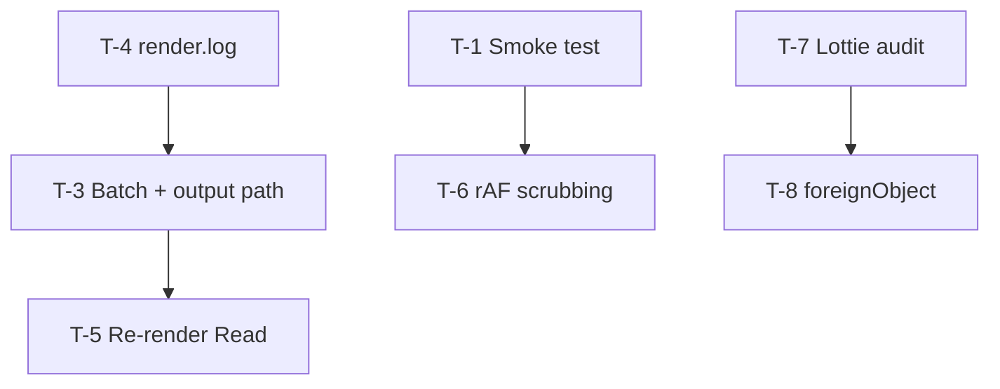

# SVG-to-Nuke — Foreman Plan

**Created:** 2026-07-12  
**Status:** Planning only — no implementation started  
**Foreman handoff:** Read this file first, then `PROJECT_STATE.md` for current state.

---

## Mission

Ship two production-facing capabilities and a regression safety net around the F-1 sync / UV alpha work already merged:

| Priority | ID | Capability | Why now |
|----------|-----|------------|---------|
| **P0** | T-1 | Automated smoke test | Locks F-1 two-pass sync + UV alpha parity; prevents silent regressions |
| **P1** | T-3 | Batch import + output path override | Production scale for sticker packs / UI sets; CLI parity in Nuke |

Secondary track (same sprint, lower priority):

| ID | Capability |
|----|------------|
| T-4 | `render.log` next to frame sequence |
| T-5 | Re-render / update selected Read |
| T-6 | Animation fidelity — rAF-only scrubbing |
| T-7 | Lottie feature support audit (documentation) |
| T-8 | SVG `<foreignObject>` handling |

### Explicitly out of scope (this plan)

- **Object ID pass** — already shipped (E-7); no new work unless a bug is filed.
- **Normal / beauty-only pass improvements** — user request: ignore for now.
- **F-4 user re-test in Nuke** — manual validation on emoji sticker asset; not blocked on code.

---

## Current baseline (do not re-litigate)

| Area | State |
|------|-------|
| F-1 sync fix | **Done** — pause all layers, `sync_to_frame()` before every screenshot, two-pass capture |
| F-5 UV alpha parity | **Done** — stroke coverage, expanded selectors; `test_assets/check_alpha.py` exists |
| CLI `--out` | **Done** — full path override with `####` frame token |
| Nuke output path | **Hardcoded** — `{dirname}/{basename}_frames/{basename}.####.png` |
| Nuke node graph | **Read nodes only** — no STMap wiring |
| Automated tests | **None in CI** — manual `check_alpha.py` + ad-hoc CLI renders |
| `render.log` | **Does not exist** |

---

## Architecture touchpoints

```
┌─────────────────────────────────────────────────────────────────────────┐
│  nuke_svg_import.py                                                     │
│    T-3  import_folder() + output_dir picker                             │
│    T-3  --out passed to subprocess (replace hardcoded out_dir)          │
│    T-5  reimport_selected_read() — menu on Read nodes                   │
│    T-5  store raster settings in Read node metadata (knob or label)    │
└───────────────────────────────┬─────────────────────────────────────────┘
                                │ QProcess
                                ▼
┌─────────────────────────────────────────────────────────────────────────┐
│  svg_to_frames.py                                                       │
│    T-4  write render.log in out_dir (settings, timing, Lottie meta)     │
│    T-6  rAF time-override hook in sync_to_frame path                    │
│    T-8  foreignObject detection + warning or alternate capture          │
└───────────────────────────────┬─────────────────────────────────────────┘
                                │
                                ▼
┌─────────────────────────────────────────────────────────────────────────┐
│  tests/ (new)                                                           │
│    T-1  smoke_test.sh / run_smoke.py — Lottie + SVG UV alpha parity     │
└─────────────────────────────────────────────────────────────────────────┘
```

---

## Phase 0 — Regression safety net (T-1)

**Goal:** One command proves F-1 sync + UV alpha parity still hold after any change.

### Deliverables

1. **`tests/run_smoke.py`** (or `scripts/smoke_test.py`) — orchestrator, no Nuke required.
2. **Test matrix (minimal):**
   - `test_assets/sample_bounce.json` — Lottie, color only, `--auto-frames`, small resolution (256²).
   - `test_assets/rocket_test.svg` — SMIL/CSS, **color + UV**, `--auto-frames`.
3. **Assertions per case:**
   - Exit code 0 from `svg_to_frames.py`.
   - Expected frame count written (match Lottie `op-ip` or detected loop).
   - UV case: alpha parity via logic from `test_assets/check_alpha.py` (≤0.1% pixels differ >8/255).
   - Optional: file size / non-empty PNG sanity check.
4. **`tests/smoke_test.sh`** — thin wrapper for CI / local one-liner:
   ```bash
   python tests/run_smoke.py && echo "SMOKE OK"
   ```
5. **Document** in README under "Development / smoke test".

### Acceptance criteria

- [ ] `python tests/run_smoke.py` passes on clean checkout after `playwright install chromium`.
- [ ] Intentionally breaking `sync_to_frame` (local dev only) causes smoke failure.
- [ ] Runtime &lt; 2 min on typical laptop (256², short sequences).

### Files touched

| File | Change |
|------|--------|
| `tests/run_smoke.py` | **New** |
| `tests/smoke_test.sh` | **New** (optional) |
| `test_assets/check_alpha.py` | Refactor into importable `compare_alpha_passes()` or duplicate minimally |
| `README.md` | Smoke test section |
| `.gitignore` | Ignore `tests/out_*` scratch dirs |

### Dependencies

None — **start here**.

---

## Phase 1 — Production scale (T-3)

**Goal:** Import many files with shared settings; write frames anywhere (CLI parity).

### 2a. Output path override (Nuke)

**UI:** Add optional "Output directory" row on import panel.

| State | Behavior |
|-------|----------|
| Empty | Current default: `{source_dir}/{basename}_frames/` |
| Set | `{chosen_dir}/{basename}.####.png` (same filename pattern as today) |

Pass `--out` to subprocess (already supported by `svg_to_frames.py`).

**Edge cases:**

- Create output dir if missing.
- Warn if output dir exists and contains frames (overwrite is implicit — log in `render.log`).
- Windows path normalization (forward slashes in patterns are fine for Nuke Reads).

### 2b. Batch import

**UI:** New menu item: **File → Batch Import Animated SVG...**

| Step | Behavior |
|------|----------|
| 1 | Folder picker (not file picker) |
| 2 | Same settings panel as single import (W/H, frames, fps, auto toggles, UV — **no ID** per scope) |
| 3 | Optional output root (same override as 2a) |
| 4 | Queue: one `QProcess` at a time (or parallel with cap=2 — **v1: serial only**) |
| 5 | Progress panel shows current file + overall `3/12` |
| 6 | On each completion: create Read nodes for each pass |
| 7 | Layout: stack each asset's Reads vertically (+150px Y per asset) |

**File discovery:**

```python
sorted(folder.glob("*.svg")) + sorted(folder.glob("*.json")) + sorted(folder.glob("*.html"))
```

Skip hidden files, `_*`, and optionally skip if `{basename}_frames/` already exists (checkbox: "Skip existing").

### Acceptance criteria

- [ ] Single import with custom output dir writes to chosen path; Read pattern matches.
- [ ] Batch of 3+ test assets completes without Nuke freeze (async preserved).
- [ ] Each asset gets correctly named sequence and Read nodes per pass.
- [ ] Failure on asset N does not block asset N+1 (log error, continue).

### Files touched

| File | Change |
|------|--------|
| `nuke_svg_import.py` | Panel field, `import_animated_svg()`, new `batch_import_animated_svg()` |
| `nuke_svg_import.py` | `install()` — second menu entry |

### Dependencies

- T-4 (`render.log` helps debug batch failures) — soft dependency.

---

## Phase 3 — Observability (T-4)

**Goal:** `render.log` beside the frame sequence for "it worked yesterday" debugging.

### Log location

`{out_dir}/render.log` — same directory as `*.0001.png`.

### Log contents (append mode if re-render; **v1: overwrite per run**)

```
SVG-to-Nuke render log
======================
timestamp_utc: 2026-07-12T09:15:00Z
svg_to_frames_version: <git hash or file mtime>
input: /path/to/asset.json
output_pattern: /path/to/out/asset.####.png
settings: width=1920 height=1080 fps=30 frames=72 auto_frames=true
passes: color,uv
lottie_meta: { "frameRate": 30, "totalFrames": 60, "ip": 0, "op": 60 }
detected: { "isLottie": true, "totalFrames": 60, ... }
timing:
  browser_launch_ms: 1200
  color_pass_ms: 45000
  uv_pass_ms: 48000
  total_ms: 95000
frames_written: 60
errors: []
warnings: ["selector 'body' used full viewport"]
```

### Implementation notes

- Collect timing with `time.monotonic()` around browser launch, each pass loop, total.
- Capture `page.on("console")` / `pageerror` warnings into `warnings` list.
- Write log in `finally` block so partial failures still produce a log.
- Nuke progress panel: link to log path on completion (`nuke.tprint`).

### Acceptance criteria

- [ ] Every rasterize run produces `render.log` in output dir.
- [ ] Failed run (exception mid-loop) still writes log with `errors: [...]`.
- [ ] Lottie JSON inputs include parsed metadata section.

### Files touched

| File | Change |
|------|--------|
| `svg_to_frames.py` | `_RenderLog` helper, integrate in `rasterize()` |

### Dependencies

None — can parallelize with T-3.

---

## Phase 4 — Re-render selected Read (T-5)

**Goal:** "Re-import source" on an existing import without rebuilding nodes by hand.

### Metadata storage

Store on Color Read node (hidden knobs or encoded `label` / custom knob):

| Field | Example |
|-------|---------|
| `svg_source` | `/path/to/rocket.svg` |
| `svg_width`, `svg_height` | 1920, 1080 |
| `svg_fps`, `svg_frames` | 30, 72 |
| `svg_auto_frames`, `svg_auto_fps` | true, true |
| `svg_uv_pass` | true |
| `svg_out_pattern` | `/path/to/rocket_frames/rocket.####.png` |

Use `nuke.Text_Knob` / `nuke.String_Knob` with `setFlag(nuke.INVISIBLE)` or a dedicated tab "SVG Import".

### UX

- Context menu or **Nodes → Re-render SVG Source** when a Read with `svg_source` is selected.
- Confirm dialog: "Re-rasterize {basename}? This overwrites existing frames."
- Re-run subprocess with stored settings.
- On success: refresh Read `first`/`last`; UV Read sibling found by naming convention or stored knob reference.

### Acceptance criteria

- [ ] New imports stamp metadata on Color Read.
- [ ] Re-render overwrites sequence; frame range updates if length changed.
- [ ] Missing source file → clear error, no crash.

### Files touched

| File | Change |
|------|--------|
| `nuke_svg_import.py` | Metadata knobs, `reimport_selected_read()`, menu hook |

### Dependencies

- T-3 (output path stored in metadata).

---

## Phase 5 — Animation fidelity (T-6)

**Goal:** Improve scrubbing for `requestAnimationFrame`-only animations (no WAAPI / SMIL).

### Known limitation

`sync_to_frame` drives WAAPI `currentTime` and SMIL `setCurrentTime`. Pure rAF loops ignore both.

### Approach (investigate → implement)

1. **Detection pass** at load time:
   ```js
   // Flag if animation exists but getAnimations() returns empty and no SMIL
   ```
2. **Time override injection** (preferred):
   - Inject `<script>` shim before page scripts run (Playwright `add_init_script`):
   ```js
   window.__nukeTimeMs = 0;
   const _now = performance.now.bind(performance);
   performance.now = () => window.__nukeTimeMs;
   ```
   - Set `window.__nukeTimeMs = frame_index / fps * 1000` in `sync_to_frame` when rAF-only mode detected.
3. **Fallback:** Document as unsupported if shim breaks specific assets.

### Acceptance criteria

- [ ] At least one rAF-only test asset scrubs correctly (may need new `test_assets/raf_clock.svg`).
- [ ] Existing smoke tests (T-1) still pass — shim must not affect Lottie/WAAPI/SMIL paths.
- [ ] `render.log` notes `scrub_mode: waapi|smil|lottie|raf_shim`.

### Files touched

| File | Change |
|------|--------|
| `svg_to_frames.py` | Detection, init script, `sync_to_frame` branch |
| `test_assets/` | Optional rAF test SVG |

### Dependencies

- T-1 smoke test **required** before merge (high regression risk).

### Risk

**Medium** — `performance.now` override is global; may break libraries. Gate behind detection flag.

---

## Phase 6 — Documentation audits (T-7, T-8)

### T-7 — Lottie feature support matrix

**Deliverable:** `docs/LOTTIE_SUPPORT.md` (or section in README).

| Category | Support | Notes |
|----------|---------|-------|
| Shapes (path, rect, ellipse, star) | ✅ | Via lottie-web SVG renderer |
| Layer parenting | ✅ | |
| Position / rotation / scale keyframes | ✅ | `goToAndStop` |
| Opacity, fill, stroke | ✅ | |
| Masks (mask mode) | ⚠️ | Test per asset |
| Merge paths | ⚠️ | |
| Expressions | ❌ | lottie-web limited; document workarounds |
| Effects (blur, tint, etc.) | ❌ / ⚠️ | List tested vs untested |
| Text layers | ⚠️ | Font rendering depends on system fonts |
| Images / precomps | ⚠️ | Embedded assets must resolve |
| Plugins (Bodymovin custom) | ❌ | Unless shipped in JSON |

**Method:** Run 5–10 representative Lottie fixtures; record pass/fail screenshots. No code required for v1 — audit only.

### T-8 — SVG `<foreignObject>`

**Investigation:**

1. Grep test corpus for `foreignObject`.
2. Load in Chromium — does Playwright screenshot include HTML content?
3. If yes: document. If no: detect + `render.log` warning; consider rasterizing foreignObject subtree via separate HTML screenshot composite (v2).

**v1 deliverable:** Detection warning in log + README limitation entry.

### Dependencies

None — can run in parallel anytime.

---

## Recommended execution order

```
Week 1 — Safety + observability
├── T-1  Automated smoke test          [P0, no deps]
└── T-4  render.log                     [parallel]

Week 2 — Production scale
├── T-3a Output path override
├── T-3b Batch import
└── T-5  Re-render selected Read        [after T-3a metadata pattern]

Week 3 — Fidelity + docs
├── T-6  rAF scrubbing                  [after T-1, careful]
├── T-7  Lottie audit doc
└── T-8  foreignObject audit
```



---

## Task checklist (foreman copy-paste)

| ID | Task | Owner | Status |
|----|------|-------|--------|
| T-1 | `tests/run_smoke.py` + README | | ⬜ |
| T-3a | Output directory picker + `--out` wiring | | ⬜ |
| T-3b | Batch import menu + serial queue | | ⬜ |
| T-4 | `render.log` in `svg_to_frames.py` | | ⬜ |
| T-5 | Read metadata + re-import command | | ⬜ |
| T-6 | rAF `performance.now` shim | | ⬜ |
| T-7 | `docs/LOTTIE_SUPPORT.md` | | ⬜ |
| T-8 | foreignObject detect + warn | | ⬜ |

---

## Risks and mitigations

| Risk | Impact | Mitigation |
|------|--------|------------|
| Smoke test flaky on timing | CI noise | Fixed 256² resolution; deterministic `goToAndStop` for Lottie |
| Batch import floods disk | User error | Confirm total frame estimate; optional skip-existing |
| rAF shim breaks Lottie | Regression | Detection-gated; T-1 must pass before merge |
| Re-render stale metadata | Wrong settings | Version stamp in metadata; validate on menu open |

---

## Success metrics

1. **T-1:** One command, &lt;2 min, catches sync/alpha regressions.
2. **T-3:** Folder of 10 Lotties imports overnight with shared 1920×1080 settings.
3. **T-4:** Any support ticket includes `render.log` with timing + Lottie meta.
4. **T-5:** Changing source SVG and clicking re-render updates comp without node surgery.

---

## Handoff to implementation agent

**Start with T-1.** Do not begin T-6 until T-1 is green. Ignore Object ID pass for new UI work unless fixing a bug.

After each phase:

1. Run `python tests/run_smoke.py`.
2. Append session notes to `DEV_LOG.md`.
3. Update task status in this file and `PROJECT_STATE.md` enhancement table.
